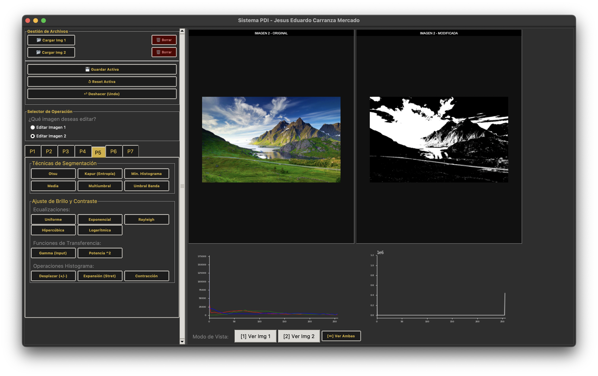
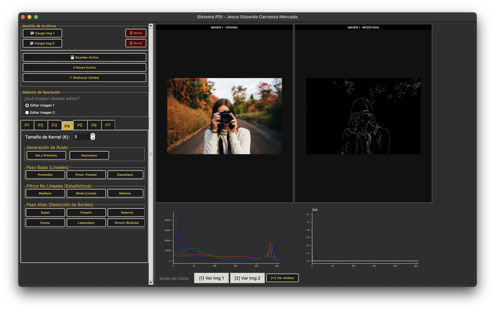
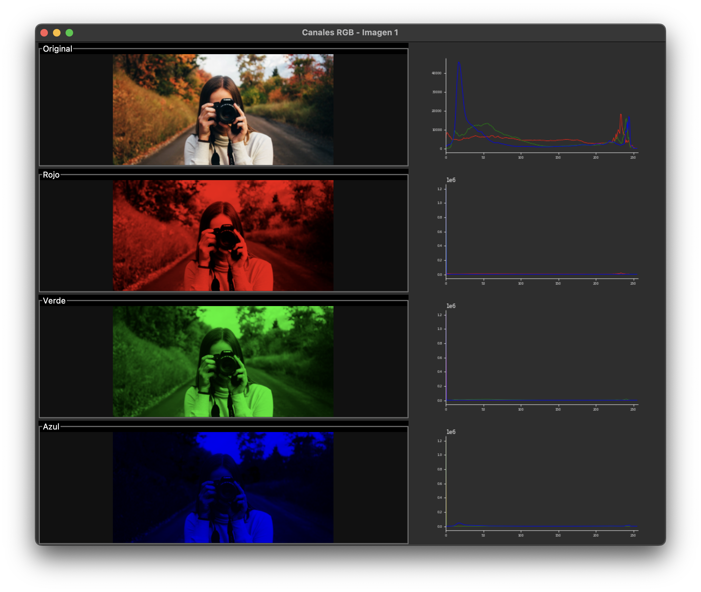

# 📷 DIP-Toolkit

Este proyecto es una aplicación de escritorio completa desarrollada en Python para el análisis, procesamiento y manipulación de imágenes digitales. Proporciona una interfaz gráfica intuitiva (GUI) que permite aplicar algoritmos matemáticos complejos de forma visual e interactiva.

El objetivo principal es servir como herramienta educativa y práctica para visualizar cómo actúan los diferentes algoritmos de visión por computadora, desde operaciones básicas de histograma hasta filtrado en el dominio de la frecuencia.

# 📸 Ejemplos de Uso

**1. Vista General de la Interfaz**


**2. Detección de Bordes (Filtro Canny)**


**3. Segmentación de Canales RGB**


# ⚙️ Instalación y Prerrequisitos
Para ejecutar este sistema necesitas tener instalado **Python 3.x** en tu computadora.

**1. Clonar el repositorio**

Descarga el proyecto o clona el repositorio en tu máquina local:

```Bash
git clone https://github.com/JesusCarramza/DIP-Toolkit.git
```

**2. Instalar requerimientos**

El sistema utiliza varias librerías científicas y de interfaz. Puedes instalarlas ejecutando el siguiente comando:

```Bash
pip install -r requirements.txt
```

# 🚀 Uso y Ejecución

Una vez instaladas las dependencias, la aplicación se inicia desde el archivo principal.

1. Abre tu terminal en la carpeta raíz del proyecto.

2. Ejecuta el siguiente comando:

```Bash
python main.py
```

**Flujo de trabajo básico:**

**1. Cargar Imagen:** Usa los botones "Cargar Img 1" o "Cargar Img 2" en la barra superior.

**2. Seleccionar Slot:** Elige qué imagen quieres editar usando el "Selector de Operación".

**3. Aplicar Filtros:** Navega por las pestañas (P1 a P7) y haz clic en los botones para aplicar efectos.

**4. Visualizar:** Observa los resultados en tiempo real, incluyendo los histogramas actualizados.

# 🛠 Tecnologías Utilizadas
Este proyecto fue construido íntegramente en Python utilizando las siguientes librerías clave:

- **Tkinter:** Para la construcción de la Interfaz Gráfica de Usuario (GUI), manejo de eventos y ventanas modales.

- **OpenCV (cv2):** Motor principal para la lectura de imágenes, transformaciones de color y algoritmos de visión por computadora.

- **NumPy:** Para el manejo eficiente de matrices y operaciones matemáticas de bajo nivel sobre los píxeles.

- **SciPy (ndimage):** Utilizado para filtros estadísticos avanzados y procesamiento n-dimensional (Filtro Moda).

- **Matplotlib:** Integrado en la interfaz para renderizar histogramas en tiempo real y gráficos de análisis.

- **Pillow (PIL):** Para la conversión y visualización de imágenes dentro de los componentes de Tkinter.

# ✨ Características y Módulos
El sistema cubre 7 áreas prácticas del procesamiento de imágenes:

- **P1 - Básicos/Color:** Conversión a escala de grises, binarización (Manual, Otsu, Adaptativo) y separación de canales (RGB, HSV, CMY).

- **P2 - Mapa de Color:** Aplicación de falsos colores (Heatmaps) predefinidos y creación de mapas personalizados por el usuario.

- **P3 - Aritmética/Lógica:** Suma, resta y multiplicación de imágenes; operaciones lógicas (AND, OR, XOR) y detección de contornos.

- **P4 - Filtros/Ruido:** Suavizado (Gauss, Media), eliminación de ruido (Mediana) y detección de bordes (Sobel, Canny, Laplaciano).

- **P5 - Segmentación:** Técnicas de umbralización avanzada, histogramas y ajuste de contraste (Gamma, Ecualización).

- **P6 - Morfología:** Erosión, dilatación, apertura, cierre y gradiente morfológico.

- **P7 - Frecuencia:** Transformada de Fourier, espectros de magnitud/fase y filtros pasa-bajas/altas (Ideal, Butterworth, Gaussiano).

# ✒️ Autor y Referencias

**Autor Principal:**

- Jesus Eduardo Carranza Mercado (Escuela Superior de Computo)

**Referencias:**

- Documentación oficial de OpenCV y SciPy.

- Documentación de Matplotlib.